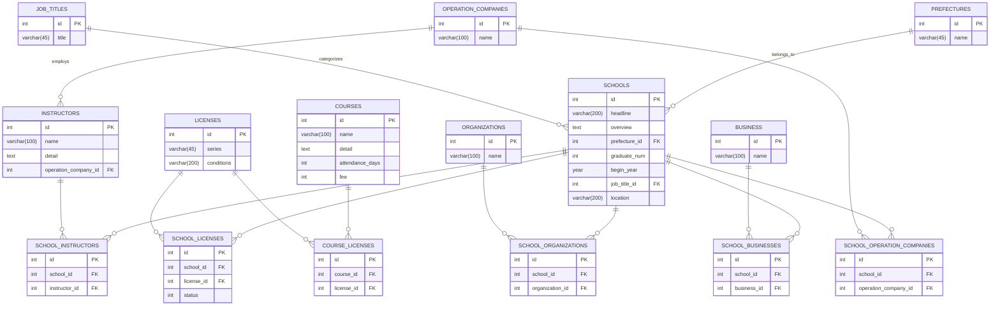

# ドローンスクール管理システム ER 図

この ER 図は `drone-school-dump-fixed.sql` に基づいて作成されています。

## エンティティ関連図



## システム概要

このドローンスクール管理システムは以下の要素で構成されています：

### 🏫 メインエンティティ

- **SCHOOLS**: ドローンスクールの基本情報
- **COURSES**: 提供されるコース情報
- **INSTRUCTORS**: 講師情報
- **LICENSES**: 取得可能なライセンス情報

### 📍 マスタデータ

- **PREFECTURES**: 都道府県情報
- **JOB_TITLES**: 職種分類
- **ORGANIZATIONS**: 関連組織
- **BUSINESS**: 業種分類
- **OPERATION_COMPANIES**: 運営会社

### 🔗 関係性の詳細

#### 直接的な関連（一対多）

- 各スクールは 1 つの都道府県に属する
- 各スクールは 1 つの職種カテゴリを持つ
- 各講師は 1 つの運営会社に所属する

#### 多対多の関連

- **スクール ↔ ライセンス**: スクールで取得可能なライセンス
- **スクール ↔ 講師**: スクールに所属する講師
- **コース ↔ ライセンス**: コースで取得可能なライセンス
- **スクール ↔ 組織**: スクールが関連する組織
- **スクール ↔ 業種**: スクールが対応する業種
- **スクール ↔ 運営会社**: スクールを運営する会社

### 💡 設計のポイント

1. **正規化された設計**: データの重複を避け、整合性を保つ
2. **柔軟な関係性**: 多対多の関係を適切に表現
3. **拡張性**: 新しい属性や関係を追加しやすい構造
4. **マスタデータ管理**: 都道府県、職種等の基本データを分離

### 🚀 使用例

```sql
-- スクールとその取得可能ライセンスを取得
SELECT s.headline, l.series
FROM schools s
JOIN school_licenses sl ON s.id = sl.school_id
JOIN licenses l ON sl.license_id = l.id
WHERE s.prefecture_id = 1;

-- 講師とその所属スクールを取得
SELECT i.name, s.headline
FROM instructors i
JOIN school_instructors si ON i.id = si.instructor_id
JOIN schools s ON si.school_id = s.id;
```
