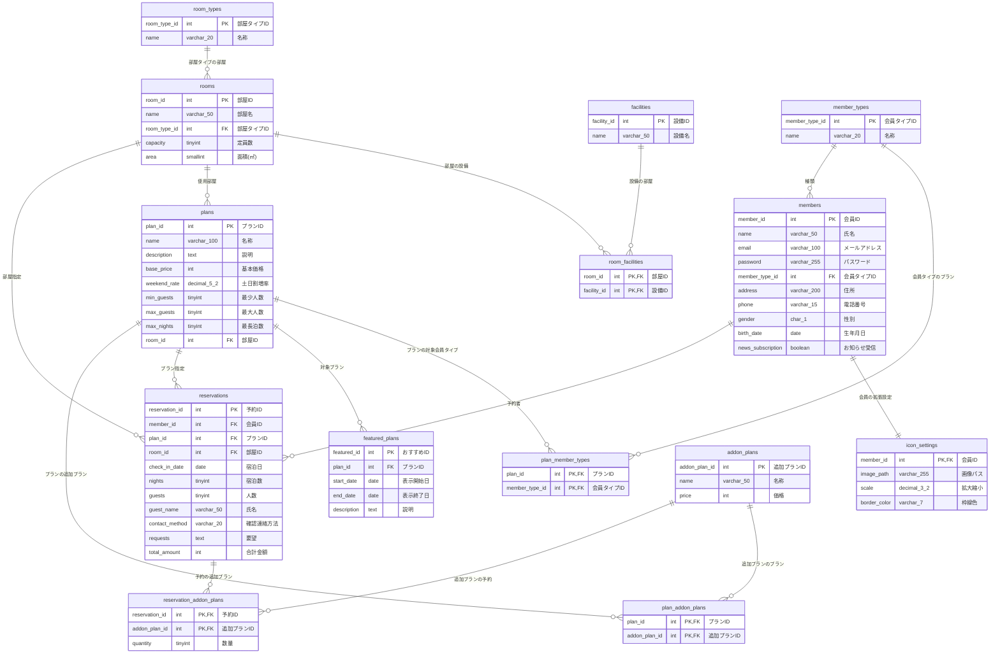

# ER 図（物理設計）- NN 制約なしバージョン

```mermaid
erDiagram
    room_types {
        room_type_id int PK "部屋タイプID"
        name varchar_20 "名称"
    }

    rooms {
        room_id int PK "部屋ID"
        name varchar_50 "部屋名"
        room_type_id int FK "部屋タイプID"
        capacity tinyint "定員数"
        area smallint "面積(㎡)"
    }

    facilities {
        facility_id int PK "設備ID"
        name varchar_50 "設備名"
    }

    room_facilities {
        room_id int PK,FK "部屋ID"
        facility_id int PK,FK "設備ID"
    }

    plans {
        plan_id int PK "プランID"
        name varchar_100 "名称"
        description text "説明"
        base_price int "基本価格"
        weekend_rate decimal_5_2 "土日割増率"
        min_guests tinyint "最少人数"
        max_guests tinyint "最大人数"
        max_nights tinyint "最長泊数"
        room_id int FK "部屋ID"
    }

    member_types {
        member_type_id int PK "会員タイプID"
        name varchar_20 "名称"
    }

    plan_member_types {
        plan_id int PK,FK "プランID"
        member_type_id int PK,FK "会員タイプID"
    }

    featured_plans {
        featured_id int PK "おすすめID"
        plan_id int FK "プランID"
        start_date date "表示開始日"
        end_date date "表示終了日"
        description text "説明"
    }

    members {
        member_id int PK "会員ID"
        name varchar_50 "氏名"
        email varchar_100 "メールアドレス"
        password varchar_255 "パスワード"
        member_type_id int FK "会員タイプID"
        address varchar_200 "住所"
        phone varchar_15 "電話番号"
        gender char_1 "性別"
        birth_date date "生年月日"
        news_subscription boolean "お知らせ受信"
    }

    icon_settings {
        member_id int PK,FK "会員ID"
        image_path varchar_255 "画像パス"
        scale decimal_3_2 "拡大縮小"
        border_color varchar_7 "枠線色"
    }

    reservations {
        reservation_id int PK "予約ID"
        member_id int FK "会員ID"
        plan_id int FK "プランID"
        room_id int FK "部屋ID"
        check_in_date date "宿泊日"
        nights tinyint "宿泊数"
        guests tinyint "人数"
        guest_name varchar_50 "氏名"
        contact_method varchar_20 "確認連絡方法"
        requests text "要望"
        total_amount int "合計金額"
    }

    addon_plans {
        addon_plan_id int PK "追加プランID"
        name varchar_50 "名称"
        price int "価格"
    }

    plan_addon_plans {
        plan_id int PK,FK "プランID"
        addon_plan_id int PK,FK "追加プランID"
    }

    reservation_addon_plans {
        reservation_id int PK,FK "予約ID"
        addon_plan_id int PK,FK "追加プランID"
        quantity tinyint "数量"
    }

    %% リレーション
    room_types ||--o{ rooms : "部屋タイプの部屋"
    rooms ||--o{ room_facilities : "部屋の設備"
    facilities ||--o{ room_facilities : "設備の部屋"
    rooms ||--o{ plans : "使用部屋"
    plans ||--o{ plan_member_types : "プランの対象会員タイプ"
    member_types ||--o{ plan_member_types : "会員タイプのプラン"
    plans ||--o{ featured_plans : "対象プラン"
    member_types ||--o{ members : "種類"
    members ||--|| icon_settings : "会員の拡張設定"
    members ||--o{ reservations : "予約者"
    plans ||--o{ reservations : "プラン指定"
    rooms ||--o{ reservations : "部屋指定"
    plans ||--o{ plan_addon_plans : "プランの追加プラン"
    addon_plans ||--o{ plan_addon_plans : "追加プランのプラン"
    reservations ||--o{ reservation_addon_plans : "予約の追加プラン"
    addon_plans ||--o{ reservation_addon_plans : "追加プランの予約"
```
