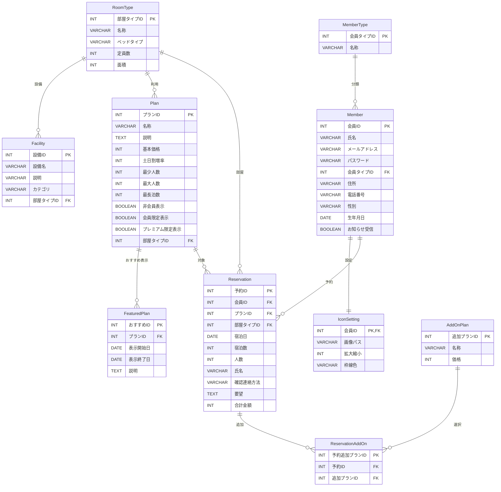

# AI Answered Physical ER Diagram

```mermaid
erDiagram
    RoomType {
        INT 部屋タイプID PK
        VARCHAR 名称
        VARCHAR ベッドタイプ
        INT 定員数
        INT 面積
    }

    Facility {
        INT 設備ID PK
        VARCHAR 設備名
        VARCHAR 説明
        VARCHAR カテゴリ
        INT 部屋タイプID FK
    }

    Plan {
        INT プランID PK
        VARCHAR 名称
        TEXT 説明
        INT 基本価格
        INT 土日割増率
        INT 最少人数
        INT 最大人数
        INT 最長泊数
        BOOLEAN 非会員表示
        BOOLEAN 会員限定表示
        BOOLEAN プレミアム限定表示
        INT 部屋タイプID FK
    }

    FeaturedPlan {
        INT おすすめID PK
        INT プランID FK
        DATE 表示開始日
        DATE 表示終了日
        TEXT 説明
    }

    Member {
        INT 会員ID PK
        VARCHAR 氏名
        VARCHAR メールアドレス
        VARCHAR パスワード
        INT 会員タイプID FK
        VARCHAR 住所
        VARCHAR 電話番号
        VARCHAR 性別
        DATE 生年月日
        BOOLEAN お知らせ受信
    }

    MemberType {
        INT 会員タイプID PK
        VARCHAR 名称
    }

    IconSetting {
        INT 会員ID PK,FK
        VARCHAR 画像パス
        INT 拡大縮小
        VARCHAR 枠線色
    }

    Reservation {
        INT 予約ID PK
        INT 会員ID FK
        INT プランID FK
        INT 部屋タイプID FK
        DATE 宿泊日
        INT 宿泊数
        INT 人数
        VARCHAR 氏名
        VARCHAR 確認連絡方法
        TEXT 要望
        INT 合計金額
    }

    AddOnPlan {
        INT 追加プランID PK
        VARCHAR 名称
        INT 価格
    }

    ReservationAddOn {
        INT 予約追加プランID PK
        INT 予約ID FK
        INT 追加プランID FK
    }

    RoomType ||--o{ Facility : "設備"
    RoomType ||--o{ Plan : "利用"
    Plan ||--o{ FeaturedPlan : "おすすめ表示"

    MemberType ||--o{ Member : "分類"
    Member ||--|| IconSetting : "設定"

    Member ||--o{ Reservation : "予約"
    Plan ||--o{ Reservation : "対象"
    RoomType ||--o{ Reservation : "部屋"

    Reservation ||--o{ ReservationAddOn : "追加"
    AddOnPlan ||--o{ ReservationAddOn : "選択"
```
