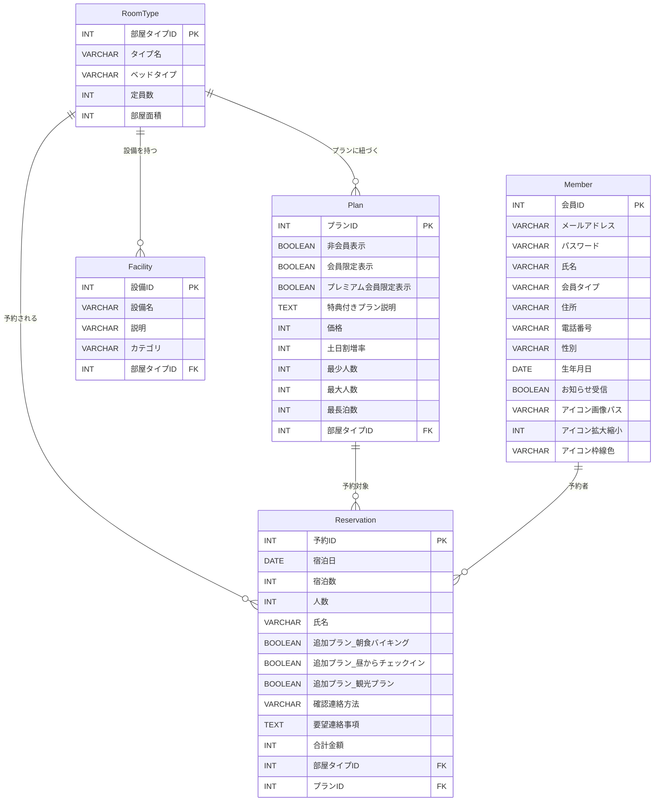

# 第一正規系

```mermaid
erDiagram

    Plan {
        INT プランID PK
        BOOLEAN 非会員表示
        BOOLEAN 会員限定表示
        BOOLEAN プレミアム会員限定表示
        TEXT 特典付きプラン説明
        INT 価格
        INT 土日割増率
        INT 最少人数
        INT 最大人数
        INT 最長泊数
        INT 部屋タイプID FK
    }

    Reservation {
        INT 予約ID PK
        DATE 宿泊日
        INT 宿泊数
        INT 人数
        VARCHAR 氏名
        BOOLEAN 追加プラン_朝食バイキング
        BOOLEAN 追加プラン_昼からチェックイン
        BOOLEAN 追加プラン_観光プラン
        VARCHAR 確認連絡方法
        TEXT 要望連絡事項
        INT 合計金額
        INT 部屋タイプID FK
        INT プランID FK
    }

    RoomType {
        INT 部屋タイプID PK
        VARCHAR タイプ名
        VARCHAR ベッドタイプ
        INT 定員数
        INT 部屋面積
    }

    Facility {
        INT 設備ID PK
        VARCHAR 設備名
        VARCHAR 説明
        VARCHAR カテゴリ
        INT 部屋タイプID FK
    }

    Member {
        INT 会員ID PK
        VARCHAR メールアドレス
        VARCHAR パスワード
        VARCHAR 氏名
        VARCHAR 会員タイプ
        VARCHAR 住所
        VARCHAR 電話番号
        VARCHAR 性別
        DATE 生年月日
        BOOLEAN お知らせ受信
        VARCHAR アイコン画像パス
        INT アイコン拡大縮小
        VARCHAR アイコン枠線色
    }

    RoomType ||--o{ Facility : "設備を持つ"
    RoomType ||--o{ Plan : "プランに紐づく"
    RoomType ||--o{ Reservation : "予約される"
    Plan ||--o{ Reservation : "予約対象"
    Member ||--o{ Reservation : "予約者"
```
