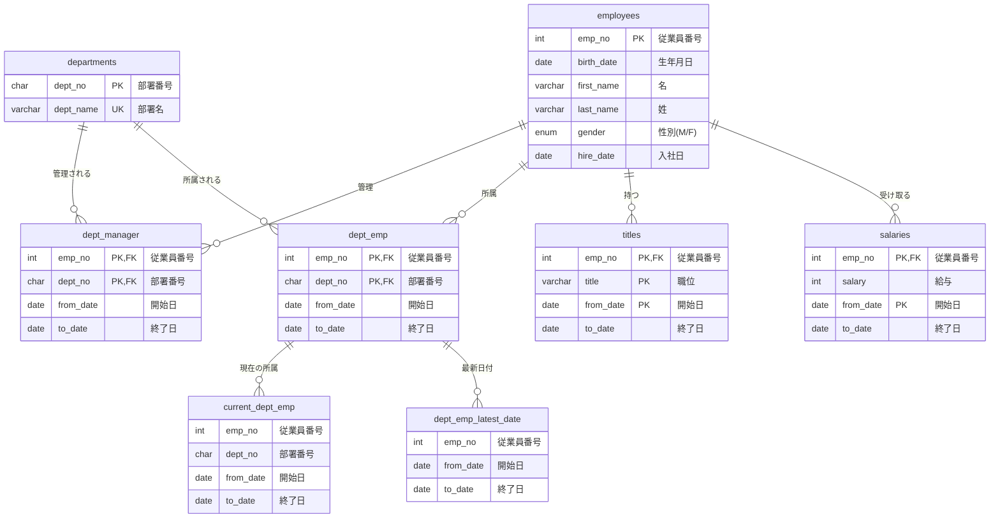

# Employee Database ER Diagram

```mermaid
erDiagram
    employees {
        int emp_no PK "従業員番号"
        date birth_date "生年月日"
        varchar first_name "名"
        varchar last_name "姓"
        enum gender "性別(M/F)"
        date hire_date "入社日"
    }

    departments {
        char dept_no PK "部署番号"
        varchar dept_name UK "部署名"
    }

    dept_manager {
        int emp_no PK,FK "従業員番号"
        char dept_no PK,FK "部署番号"
        date from_date "開始日"
        date to_date "終了日"
    }

    dept_emp {
        int emp_no PK,FK "従業員番号"
        char dept_no PK,FK "部署番号"
        date from_date "開始日"
        date to_date "終了日"
    }

    titles {
        int emp_no PK,FK "従業員番号"
        varchar title PK "職位"
        date from_date PK "開始日"
        date to_date "終了日"
    }

    salaries {
        int emp_no PK,FK "従業員番号"
        int salary "給与"
        date from_date PK "開始日"
        date to_date "終了日"
    }

    current_dept_emp {
        int emp_no "従業員番号"
        char dept_no "部署番号"
        date from_date "開始日"
        date to_date "終了日"
    }

    dept_emp_latest_date {
        int emp_no "従業員番号"
        date from_date "開始日"
        date to_date "終了日"
    }

    %% リレーションシップ
    employees ||--o{ dept_manager : "管理"
    departments ||--o{ dept_manager : "管理される"

    employees ||--o{ dept_emp : "所属"
    departments ||--o{ dept_emp : "所属される"

    employees ||--o{ titles : "持つ"
    employees ||--o{ salaries : "受け取る"

    %% ビューとの関係
    dept_emp ||--o{ current_dept_emp : "現在の所属"
    dept_emp ||--o{ dept_emp_latest_date : "最新日付"
```
